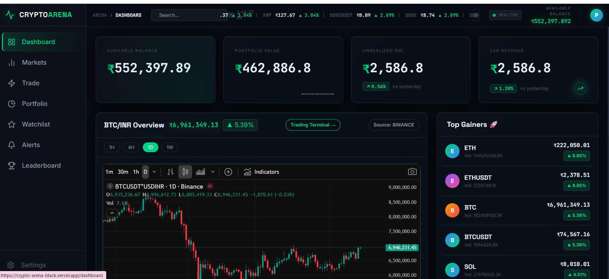
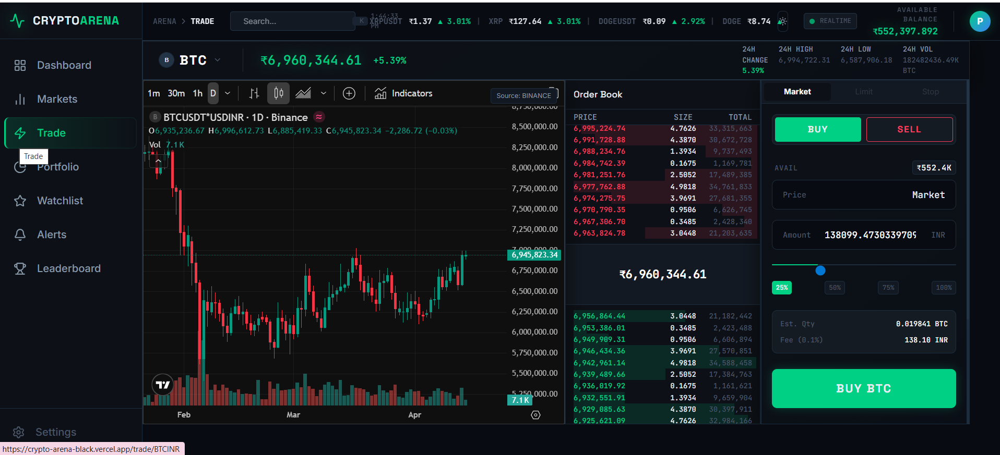
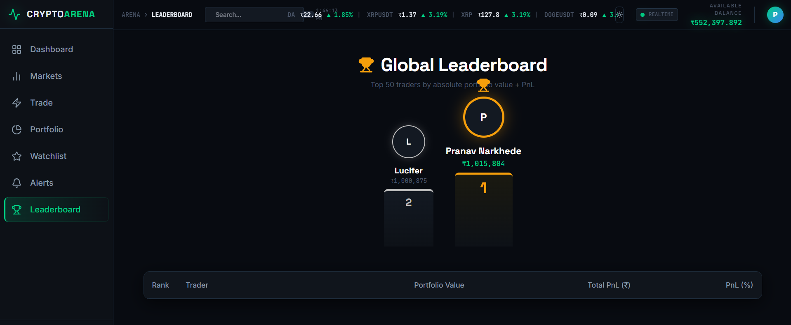

# CryptoArena ⚡️

[](https://crypto-arena-black.vercel.app/)

A premium, full-stack cryptocurrency paper-trading platform designed to mirror real market dynamics without financial risk. Built with the MERN stack and real-time WebSocket integrations, CryptoArena empowers users to practice crypto trading using live data straight from Binance.


## 🚀 Features

### ⚡ Real-Time Trading Experience
- **Live Market Data**: Real-time crypto price feeds via WebSocket connections to Binance with millisecond updates
- **Price Fluctuations**: Instant price updates with visual indicators (green/red flashes) for market movements
- **Live Order Book**: Dynamic order book simulation showing real-time bid/ask spreads
- **Real-Time P&L**: Instant portfolio valuation updates based on current market prices
- **Connection Status**: Visual indicators showing real-time data feed connectivity

### 💼 Trading Features
- **Zero-Risk Trading**: Start with virtual ₹10,00,000 balance and execute trades with zero fees
- **Multi-Coin Support**: Trade 8+ cryptocurrencies (BTC, ETH, BNB, SOL, XRP, ADA, MATIC, DOGE)
- **Coin Selector**: Easy switching between different trading pairs with live price preview
- **Market Orders**: Instant trade execution at current market prices
- **Portfolio Management**: Real-time tracking of holdings, average entry prices, and current values

### 📊 Analytics & Insights
- **Pro Trading Terminal**: Premium UI with dynamic charts, order books, and real-time analytics
- **Live Charts**: Interactive price charts with real-time candlestick data
- **P&L Analytics**: Detailed profit/loss tracking with percentage gains/losses
- **Asset Allocation**: Visual portfolio distribution charts
- **Trade History**: Complete transaction history with detailed execution data

### 🏆 Competitive Features
- **Global Leaderboards**: Real-time rankings based on total account value (wallet + holdings)
- **Performance Metrics**: Track returns, P&L percentages, and portfolio growth
- **Auto-Refresh**: Leaderboard updates every 10 minutes with live market valuations

### 📱 Mobile Experience
- **Fully Responsive**: Optimized for smartphones, tablets, and desktop devices
- **Mobile Navigation**: Collapsible menu with touch-friendly interface
- **Adaptive Layouts**: Responsive grids and card-based designs for mobile screens
- **Touch Optimized**: Larger tap targets and mobile-friendly interactions

### 🎨 User Interface
- **Professional Terminal**: Dark-themed UI matching institutional trading platforms
- **Smooth Animations**: Framer Motion powered transitions and micro-interactions
- **Real-Time Indicators**: Visual feedback for price changes, connection status, and trade executions
- **Custom Components**: Premium UI elements built with Tailwind CSS v4

## 🛠 Tech Stack

### Frontend
- **React (Vite)** - Modern React development with fast hot reload
- **Tailwind CSS v4** - Utility-first CSS framework for responsive design
- **Zustand** - Lightweight state management for real-time data
- **Framer Motion** - Smooth animations and transitions
- **Chart.js & TradingView Lightweight Charts** - Professional charting solutions
- **React Query** - Server state management and caching
- **Socket.io Client** - Real-time WebSocket connections
- **Lucide React** - Modern icon library

### Backend
- **Node.js & Express** - High-performance server framework
- **MongoDB & Mongoose** - NoSQL database with ODM
- **Socket.io** - WebSocket server for real-time data streaming
- **JSON Web Tokens** - Secure authentication and authorization
- **Binance API Integration** - Live market data and price feeds
- **CoinGecko API** - Fallback price data source
- **ExchangeRate-API** - Real-time INR conversion rates

### 🔄 Real-Time Architecture
- **WebSocket Connections**: Persistent connections for instant price updates
- **Price Cache**: In-memory caching for optimal performance
- **Fallback Mechanisms**: Multiple API sources ensure reliability
- **Circuit Breaker**: Automatic failover for API failures
- **Live Broadcasting**: Real-time price updates to all connected clients

## 🚀 Quick Start

### Prerequisites
- Node.js v18+
- MongoDB instance (local or Atlas)
- Git for version control

### 📦 Installation
1. **Clone the repository**:
   ```bash
   git clone https://github.com/PranavNarkhede2004/CryptoArena.git
   cd CryptoArena
   ```

2. **Install dependencies**:
   ```bash
   cd backend && npm install
   cd ../frontend && npm install
   ```

3. **Set up environment variables** in `backend/.env`:
   ```env
   PORT=5000
   MONGO_URI=your_mongodb_connection_string
   JWT_SECRET=your_super_secret_key
   NODE_ENV=development
   ```

### 🏃 Running the Application
1. **Start the Backend** (includes WebSocket server):
   ```bash
   cd backend
   npm run dev
   ```
   *The server will start on port 5000 with WebSocket connections*

2. **Start the Frontend**:
   ```bash
   cd frontend
   npm run dev
   ```
   *The app will open on http://localhost:5173*

3. **Open your browser** and navigate to `http://localhost:5173`

### 🌐 Live Deployment
View the live application: [CryptoArena Live](https://crypto-arena-black.vercel.app/)

## � Screenshots

### 🏠 Dashboard

*Main dashboard with real-time portfolio overview and market statistics*

### 💰 Portfolio Management

*Comprehensive portfolio view with holdings, P&L analytics, and asset allocation*

### 📊 Trading Interface

*Professional trading terminal with live charts, order book, and instant execution*

### 📱 Mobile Experience

*Fully responsive mobile interface optimized for trading on the go*

### 🏆 Leaderboard

*Global rankings based on real-time portfolio valuations and performance metrics*

### 🤝 Authentication & Onboarding

*Secure authentication system with user registration and login interface*

### � Market Overview

*Live market data with price charts, volume indicators, and top gainers/losers*

## ��📱 Mobile Responsiveness

CryptoArena is fully optimized for mobile devices:
- **Responsive Design**: Adapts seamlessly to smartphones, tablets, and desktops
- **Touch Interface**: Mobile-friendly navigation and interactions
- **Performance**: Optimized for mobile browsers with reduced data usage
- **Cross-Platform**: Works on iOS, Android, and desktop browsers

## 🔧 Real-Time Features

### WebSocket Integration
- **Live Price Feeds**: Sub-second price updates from Binance
- **Connection Monitoring**: Real-time connection status indicators
- **Auto-Reconnection**: Automatic reconnection on connection loss
- **Fallback Systems**: Multiple data sources ensure reliability

### Price Updates
- **Instant Fluctuations**: Visual price change indicators
- **Market Data**: 24h price changes, volume, and market statistics
- **Portfolio Valuation**: Real-time portfolio value calculations
- **Leaderboard Updates**: Live ranking updates based on current market prices

## 🎯 Trading Features

### Supported Cryptocurrencies
- **Bitcoin (BTC)**, **Ethereum (ETH)**, **Binance Coin (BNB)**
- **Solana (SOL)**, **Ripple (XRP)**, **Cardano (ADA)**
- **Polygon (MATIC)**, **Dogecoin (DOGE)**

### Trading Mechanics
- **Market Orders**: Instant execution at current market prices
- **Virtual Balance**: Start with ₹10,00,000 for paper trading
- **Zero Fees**: Commission-free trading for educational purposes
- **Real-Time P&L**: Instant profit/loss calculations

## ⚠️ Disclaimers
This platform is strictly for **educational and simulation purposes**. The virtual balances and prices shown do not reflect actual real-world capital or guarantee the outcomes of trades made on live exchanges.

**Risk Warning**: Cryptocurrency trading involves substantial risk of loss and is not suitable for all investors. This platform is for learning purposes only.

## 📄 License
MIT License - feel free to use this project for learning and development purposes.

---

**Built with ❤️ for the crypto community**

*Experience the thrill of crypto trading without the risk - only on CryptoArena!* 🚀
